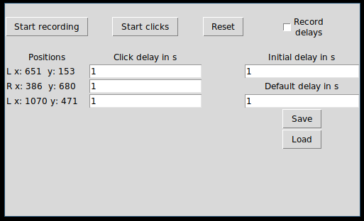

# clickrecorder
Small script to record the positions of mouse clicks and repeat them automatically.

## Features
- Record pattern of mouse clicks and repeat it infinitely
- Either manually set delays between clicks or also record them
- Supports left/right click only
- Save and load click patterns
- Set inital delay before the script starts clicking
- Scroll to stop the script from clicking
- Currently, the upper speed limit is about 5 clicks per second

## Dependencies
- Python 3.6+
- tk
- pyautogui
- pynput
